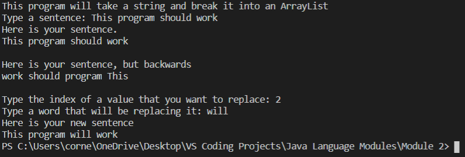

# Overview
A program that is able to take a sentence the user gives it and break in up into an ArrayList. This allows the program to modify the sentence. Created with Java, Visual Studio Code, and Github/GIT

# Developement Enviroment

* Visual Studio Code
* Java 8

# Execution

To run the program: Type 'javac sentenceBreaker.java' to compile and then 'java sentenceBreaker' to run. Or, you can simply click the play button in VS Code

# Useful Information

[Java documentation](https://docs.oracle.com/javase/tutorial/)
[Helpful Java website](https://www.w3schools.com/java/default.asp)